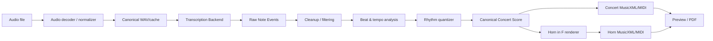

# HornScribe 開発計画

> Status: Initial architecture / implementation plan  
> Updated: 2026-09-21  
> Scope: 個人利用、完全無料、ローカル完結、Windowsを第一対象とする

> **Roadmap authority:** 実装順・マイルストーン・Go/No-Go条件は [MASTER_PLAN.md](MASTER_PLAN.md) を優先する。  
> **GUI architecture:** 高品質なdesktop UIについては [GUI / UX Design & Implementation Plan](GUI_UX_PLAN.md) と [ADR-0001](adr/ADR-0001-desktop-ui-architecture.md) を参照する。Tauri 2 + React/TypeScript + Python worker構成は技術spike通過後に正式固定する。

## 0. この文書の位置づけ

この文書を HornScribe の実装上の基準書とする。

HornScribe の目的は、ローカルの音声ファイルから音符情報を推定し、人間が読める楽譜へ整形したうえで、

1. コンサートピッチ譜
2. F管ホルン用の移調譜

を同時生成することにある。

重要なのは「Audio → MIDI」だけではない。実用上もっと難しいのは、推定された連続時間のノート列を、拍・小節・休符・タイ・調号・異名同音を含む**読みやすい記譜**に変換する工程である。

したがって本プロジェクトでは、採譜AI、リズム量子化、記譜、ホルン移調、MusicXML、PDF出力を明確に分離する。

---

# 1. プロジェクト原則

## 1.1 必須原則

- 個人利用を前提とする。
- 運用費は 0 円とする。
- 有料API、従量課金API、無料枠依存サービスを使用しない。
- 音源・解析結果を外部サーバーへ送信しない。
- 一度必要なOSS・モデルを導入した後は、主要機能をオフラインで利用できるようにする。
- Windows を第一対象とする。
- 音源から得た「演奏データ」と「印刷用の楽譜データ」を区別する。
- 採譜モデルは交換可能にし、一つのモデルへアプリ全体を密結合させない。
- **内部の正規表現は常に concert pitch とする。**
- F管ホルン譜は concert pitch の正規データから派生生成する。
- 元音源や raw transcription を破壊せず、後処理は再実行可能にする。

## 1.2 MVPでやらないこと

初期版では以下を必須としない。

- 完全自動のオーケストラ総譜採譜
- あらゆる拍子・テンポ変化の完全自動推定
- 高度な装飾音・複雑な連符の完全自動記譜
- DAWレベルの音声編集
- 楽譜エディタをMuseScore並みに作ること
- YouTube等からの直接ダウンロード
- クラウド同期
- アカウント機能

まず「ローカル音源 → 読める単旋律/比較的単純な旋律譜 → Horn in F」を確実に成立させる。

---

# 2. 調査から得た主要判断

## 2.1 Basic Pitch はMVPの基準バックエンドにする

Spotify Basic Pitch は軽量な自動採譜モデルで、音声からMIDI相当のノートイベントを取得できる。多声音に対応するが、公式にも「1つの楽器で最も良く機能する」と明記されている。

2026-09時点の upstream では v0.4.0 が最新で、Windows/macOS/Linux を対象としている。一方 Python 3.12 対応はちょうど upstream で作業中である。

**Python 3.10.x を製品の長期標準には固定しない。**

2026-09時点ではPython 3.10が2026年10月にEOL予定である一方、Basic Pitch 0.4.0は公式にはPython 3.11までを宣言し、Python 3.12対応はupstreamで進行中である。

そのためPhase 0で次の互換性・パッケージングmatrixを実測し、engine runtimeを決定する。

- Python 3.10 + ONNX系: 互換性確認用。EOLが目前のため長期baselineにはしない。
- Python 3.11 + Basic Pitch公式dependency path: primary stable candidate。ただしTensorFlow依存・bundle size・起動時間を測る。
- Python 3.12+: upstream対応が安定した場合の移行候補。未merge/実験branchを無条件に製品baselineへしない。

GUIはPython processから分離するため、desktop frontendのruntime要件をPython versionへ結合しない。

v1前に選定runtimeのEOLと移行計画を明記する。

参考:
- https://github.com/spotify/basic-pitch
- https://github.com/spotify/basic-pitch/blob/main/pyproject.toml

## 2.2 Basic Pitch を唯一の採譜モデルにはしない

既存の類似OSSでは、Basic Pitchに対して「倍音を別ノートとして拾う」問題を報告している例がある。

また、多楽器曲については MT3 / YourMT3+ 系の方が適したケースがある。

そのため、次の抽象インターフェースを最初から用意する。

```python
class TranscriptionBackend(Protocol):
    name: str

    def transcribe(
        self,
        audio_path: Path,
        options: TranscriptionOptions,
    ) -> TranscriptionResult:
        ...
```

初期実装:

- `BasicPitchBackend`

将来候補:

- `YourMT3Backend`
- `MT3Backend`
- 単旋律専用 pitch-tracking backend
- その他のAMTモデル

これにより、UI・記譜処理・Horn移調処理を採譜モデルから独立させる。

## 2.3 MT3 / YourMT3+ は「高度版の実験バックエンド」

### MT3

Magenta MT3 は多楽器・マルチトラック採譜に強いが、T5X / SeqIO / TensorFlow など依存関係が大きく、Windowsの個人用デスクトップアプリのMVPには重い。

upstream は2026年にも更新されているが、HornScribeの最初のバックエンドにはしない。

参考:
- https://github.com/magenta/mt3

### YourMT3+

YourMT3+ は多楽器曲を直接マルチトラックMIDI化できる有力候補。将来の「市販曲から主旋律や特定楽器を採譜」機能では重要な検討対象とする。

ただし、

- upstream は研究色が強い
- GPUの恩恵が大きい
- 導入サイズが大きい
- ソース、モデル重み、派生実装のライセンス確認が必要

ため、MVPには含めない。

参考:
- https://github.com/mimbres/YourMT3
- https://arxiv.org/abs/2407.04822

## 2.4 音源分離は必須前処理にしない

Demucs は有力だが、元の Meta リポジトリは保守終了で、作者forkも重要なバグ修正中心である。

さらに、

```text
混合音源
→ source separation
→ 分離アーティファクト
→ transcription
```

では、分離誤差が採譜誤差へ連鎖する。

したがって音源分離は**オプション**にする。

MVP:
- 音源を直接 Basic Pitch に入力

将来:
- vocals / piano / other 等を抽出してから採譜
- 「直接採譜」と「分離後採譜」をユーザーが比較できる設計

参考:
- https://github.com/facebookresearch/demucs
- https://github.com/adefossez/demucs

## 2.5 類似OSSを参考にするが、HornScribeの目的を絞る

参考実装として `mqtik/muse` が非常に近い。

特徴:

- ローカル完結
- TauriデスクトップUI
- Demucs
- Transkun
- YourMT3+
- MIDI出力
- GPU対応

HornScribeではこれをそのまま再実装せず、

**「ホルン奏者が音源を譜面化して、そのままF管譜を得る」**

ことに特化する。

特にHornScribeでは、

- MusicXML
- 読みやすい量子化
- Horn in F
- 移調楽器として正しいMusicXML
- PDF
- 原音との同期確認

を中核に置く。

参考:
- https://github.com/mqtik/muse

---

# 3. 採用技術

GUI/UX層は別文書 [GUI_UX_PLAN.md](GUI_UX_PLAN.md) の技術spikeで検証する。音楽処理のPython domainはGUI技術から独立させる。

| レイヤ | 初期採用 / 検証対象 | 用途 | 方針 |
|---|---|---|---|
| Desktop shell | Tauri 2 / Rust | native window / sidecar lifecycle / OS integration | GUI spike後に正式固定 |
| Frontend | React + TypeScript | Desktop UI | business logicを持たせない |
| UI foundation | Fluent UI React v9 + HornScribe tokens | controls / theme / accessibility | Windows 11との整合 |
| Score preview | Verovio WASM | MusicXML→interactive SVG | note/time mappingを検証 |
| Waveform | wavesurfer.js | waveform / regions / timeline | stable releaseをpin |
| Backend language | Python runtime TBD by compatibility matrix | AMT / music domain / export | 3.11をprimary candidate、3.10固定は禁止 |
| Audio decode | FFmpeg | MP3/M4A/FLAC/OGG→内部形式 | subprocess経由 |
| AMT | Basic Pitch | Audio→NoteEvent | baseline backend |
| MIDI | pretty_midi / mido | MIDI入出力 | 用途ごとに限定 |
| Signal analysis | librosa | tempo/beat等 | 必要な箇所のみ |
| Score domain | HornScribe独自モデル | canonical concert score | UIから独立 |
| Notation | music21 | 調号、音名、MusicXML支援 | domainを直接依存させすぎない |
| PDF | MuseScore Studio CLI | MusicXML→PDF | 外部実行ファイルを検出 |
| Backend tests | pytest | unit/integration | 必須 |
| Frontend tests | component/a11y/visual/E2E | GUI品質 | GUI計画に従う |

Tauri案はArchitecture Spikeを通過するまで **Proposed** とする。失敗時の第一fallbackは Qt Quick/QML。

将来配布する場合は、Tauri/React/Fluent/Verovio/wavesurfer.js/Python依存/FFmpeg/MuseScoreを含め、採用versionのライセンスとバイナリ同梱条件をrelease前に再監査する。

**個人利用MVPではクラウドAPIや有料runtimeを導入しない。**

---

# 4. システムアーキテクチャ

## 4.1 データフロー



## 4.2 最重要ルール: concert pitch を唯一の内部正規形にする

HornScribe内部では、推定音高を常に**実音**として保存する。

例:

```text
内部:
Concert C4

Concert譜:
C4

Horn in F written譜:
G4
```

Horn譜からconcertへ戻したデータをさらにHorn譜へ変換するような処理は禁止する。

`ScoreDocument` には明示的に pitch space を持たせる。

```python
class PitchSpace(Enum):
    CONCERT = "concert"
    WRITTEN_HORN_F = "written_horn_f"
```

concert以外のデータを canonical score として保存しない。

---

# 5. 内部データモデル

採譜モデルの出力を直接 music21 Stream に変換してはいけない。

まずモデル非依存の内部表現へ変換する。

## 5.1 RawNoteEvent

```python
@dataclass(frozen=True)
class RawNoteEvent:
    id: str
    transcription_revision: str
    pitch_midi: float
    onset_sec: float
    offset_sec: float
    confidence: float | None
    velocity: int | None
    source: str | None
    pitch_bends: tuple[PitchBendPoint, ...] = ()
```

## 5.2 Tempo / beat model

```python
@dataclass(frozen=True)
class Beat:
    index: int
    time_sec: float
    strength: float | None

@dataclass(frozen=True)
class TempoSegment:
    start_sec: float
    bpm: float
```

## 5.3 QuantizedNote

時間は float 秒ではなく、有理数の beat position を使う。

```python
@dataclass(frozen=True)
class QuantizedNote:
    id: str
    source_event_ids: tuple[str, ...]
    pitch_midi: int
    start_beat: Fraction
    duration_beats: Fraction
    velocity: int | None
    tie_start: bool = False
    tie_stop: bool = False
```

## 5.4 ScoreDocument

含める情報:

- schema version
- project ID
- score revision ID
- title
- source audio path + content hash
- tempo map
- time signature
- key estimate
- pickup/anacrusis
- parts
- notes/rests
- pitch space
- canonical note IDs
- provenance / source RawNoteEvent IDs
- transcription backend + version
- transcription settings
- quantization settings

Concert / Horn in F のpresentationは同じcanonical note IDを参照する。

MusicXML export時はcanonical note IDからdeterministicな `note/@id` を生成し、Verovio側のhit-testingからdomainへ戻れるようにする。

再量子化は既存ScoreDocumentを暗黙に上書きするのではなく、新しいscore revisionとして扱う。可能な限りsource event provenanceを保持する。

この中間モデルを versioned JSON として保存できるようにする。

これにより、

- 再採譜せず量子化だけやり直す
- BPMだけ変更する
- Horn譜だけ再生成する
- UI設定を変更して再レンダリングする

ことが可能になる。

---

# 6. Audio処理

## 6.1 入力

必須:

- WAV
- MP3

目標:

- M4A
- FLAC
- OGG

内部解析形式:

- mono または stereoを明示
- Basic Pitch推奨sample rateへ変換
- float32
- 一時WAV/cache

FFmpegを subprocess で呼び出し、解析用の標準フォーマットに統一する。

## 6.2 キャッシュ

元ファイルを変更しない。

```text
cache/
  <audio-hash>/
    source.json
    normalized.wav
    transcription.json
    score.json
    concert.musicxml
    horn_in_f.musicxml
```

キャッシュキーには、

- audio hash
- backend name/version
- model settings

を含める。

---

# 7. Automatic Music Transcription

## 7.1 Basic Pitch backend

出力は MIDIファイルを中間真実にせず、可能な限り Basic Pitch の note events を直接 `RawNoteEvent` に変換する。

理由:

MIDIへ一度落とすと、

- confidence
- 元モデル情報
- 高精度のタイミング
- pitch bend構造

などを失う可能性があるため。

MIDIは**出力形式**の一つとして扱う。

## 7.2 cleanup

初期後処理:

- confidence threshold
- 最小音長
- 異常に短いnote削除
- ほぼ同時刻の重複note統合
- 同音高の極短gapを統合
- 設定されたホルン実用音域外を警告
- overtone candidate のフラグ付け

重要:

倍音抑制を一律削除ルールにしない。

誤って実音を消す危険があるため、
「raw」と「cleaned」を保持し比較可能にする。

---

# 8. Beat / tempo / meter

ここは採譜精度と同じくらい重要。

## 8.1 MVP

MVPでは次を採用する。

- BPM自動推定
- 4/4を初期値
- ユーザーがBPMを上書き可能
- 拍子を手動変更可能
- beat offsetを手動調整可能

自動推定値を絶対視しない。

## 8.2 将来

- downbeat detection
- 3/4, 6/8 等の拍子推定
- tempo changes
- rubato tempo map
- pickup measure推定

を追加する。

---

# 9. Rhythm Quantizer

> Detailed algorithm and implementation contract: [QUANTIZER_DESIGN.md](QUANTIZER_DESIGN.md)

単純な「最も近い16分音符へ丸める」だけでは読みづらい譜面になる。

量子化では、

1. 演奏タイミングへの近さ
2. 記譜の単純さ
3. 拍のまとまり
4. 音価の複雑さ
5. タイの数
6. 連符の必要性

を評価する。

## 9.1 MVPグリッド

- quarter
- eighth
- sixteenth

オプション:

- eighth triplet
- sixteenth triplet

## 9.2 コスト関数の考え方

```text
cost =
  timing_error
  + notation_complexity_penalty
  + excessive_tie_penalty
  + tiny_rest_penalty
  + offbeat_fragment_penalty
```

単純なスナップ処理と、記譜コスト付き処理を比較できるようにする。

## 9.3 Raw performance と Score timing を分離

同じノートに対して、

- raw onset/offset
- quantized onset/duration

を両方保持する。

MIDI出力も将来的に、

- performance MIDI
- score MIDI

の2種類を出せる設計にする。

---

# 10. Music notation

## 10.1 初期対応

- note
- rest
- barline
- key signature
- time signature
- tempo
- tie
- accidental
- simple tuplet
- pickup measure
- treble clef

## 10.2 後回し

- grace notes
- ornaments
- trill
- glissando
- complex nested tuplets
- articulationsの自動推定
- dynamicsの自動推定

音声から確実に推定できない情報を無理に「正解」として出力しない。

---

# 11. 調・異名同音

MIDI pitchだけでは G# と Ab を区別できない。

したがって音名決定は、

- 推定key
- scale membership
- 前後の旋律
- accidental count
- voice-leading

を用いて後処理する。

MVPでは music21 の key analysis / pitch spelling を利用しつつ、必ずユーザーが調号を変更できるようにする。

将来は独自の pitch-spelling cost function を追加する。

---

# 12. F管ホルン処理

この部分は自動テストで厳密に固定する。

## 12.1 音高

F管ホルンは written pitch より sounding pitch が完全5度低い。

したがって、

```text
Concert C4
→ Horn in F written G4
```

concert → written は +P5。

## 12.2 MusicXML の transpose は逆方向

ここは非常に重要。

MusicXML `<transpose>` は、

> written pitch に何を加えると sounding pitch になるか

を表す。

Horn in F の written G が concert C になるので、MusicXMLでは written → sounding が **-P5**。

従って通常のHorn in F written scoreでは:

```xml
<transpose>
  <diatonic>-4</diatonic>
  <chromatic>-7</chromatic>
</transpose>
```

とする。

`+7` を書くのは誤り。

参考:
- https://www.w3.org/2021/06/musicxml40/musicxml-reference/elements/transpose/
- https://www.w3.org/2021/06/musicxml40/musicxml-reference/elements/chromatic/
- https://www.w3.org/2021/06/musicxml40/musicxml-reference/examples/transpose-element/

## 12.3 二重移調防止

Horn score generator の責務を次の2段階に分ける。

```text
Canonical concert notes
  ↓ +P5
Written horn notes
  ↓ MusicXML transpose metadata = -P5
Horn in F MusicXML
```

MusicXMLのnote pitch自体は written pitch を書く。

MuseScore等での再生時には `transpose=-P5` が作用し sounding pitch が元のconcert pitchになる。

必須不変条件:

```text
decode_written_pitch(horn_xml_note, horn_transposition)
== canonical_concert_pitch
```

## 12.4 調号

例:

```text
Concert C major
→ Horn written G major

Concert F major
→ Horn written C major

Concert Bb major
→ Horn written F major
```

## 12.5 ホルンの音域

アプリは音域外ノートを勝手にオクターブ移動しない。

代わりに、

- normal
- caution
- extreme

等の警告を内部に持つ。

実際の演奏可能音域は奏者レベルや文脈で変わるため、最終的な「演奏可能性判定」はユーザー判断とする。

## 12.6 ヘ音記号

歴史的なHorn bass-clef notationには流儀差がある。

MVPでは混乱を避け、

- 原則 treble clef
- modern notation
- 自動で旧式表記へ変換しない

とする。

低音域対応を追加する場合は、modern bass-clef behavior を明示し、設定として実装する。

---

# 13. MusicXML

MusicXML 4.0 を基本ターゲットにする。

出力テスト:

- music21 で再読込
- MuseScore Studioで読込
- Verovioで読込
- written pitch確認
- sounding pitch確認
- key signature確認
- tie確認
- measure duration確認

独自MusicXML patcherを用意してもよい。

理由:

music21だけにMusicXMLの全細部を任せると、transposition metadataやengraving metadataの制御が不十分な場合に修正しづらいため。

```text
ScoreDocument
→ music21 score
→ MusicXML
→ validate / patch / normalize
→ final MusicXML
```

---

# 14. PDF / score preview

## 14.1 PDF

優先:

- MuseScore Studio CLI

アプリ起動時に実行ファイルを検出する。

検出候補は設定ファイル化し、パスをハードコードしない。

MuseScoreがない場合:

- MusicXML出力は可能
- MIDI出力は可能
- PDFボタンのみ無効化
- インストールが必要と表示

## 14.2 Preview

候補:

### A. Verovio

MusicXML → SVG をローカル生成し、Qtで表示。

利点:

- 高速
- GUI内部に統合しやすい
- MuseScoreのGUIプロセスを起動しない

### B. MuseScore CLI → SVG/PNG

MuseScoreとの見た目一致は高いが、プレビュー更新のたびのCLI起動が重い。

MVP後半でA/Bを比較し、UIプレビューはVerovioを第一候補とする。

---

# 15. GUI / UX

GUIの詳細仕様、Information Architecture、design tokens、waveform/score同期、AI confidence review、accessibility、keyboard shortcuts、performance budget、visual regression testingは以下を唯一の詳細基準とする。

- [GUI / UX Design & Implementation Plan](GUI_UX_PLAN.md)
- [ADR-0001: Desktop UI Architecture](adr/ADR-0001-desktop-ui-architecture.md)

基本方針:

- Scoreを通常画面の主役にする
- Score / Review の2主要workspace
- Concert / Horn in F は別documentではなく同一canonical scoreのpresentation
- waveformとscoreを同じplayback clockへ同期
- low-confidence結果はReview modeで段階的に提示
- advanced/raw diagnostic UIは通常画面から隠す
- heavy/ML処理はPython workerで実行しfrontendをblockしない
- Tauri/React案はtechnical spike通過後に正式固定
- fallbackはQt Quick/QML

---

# 16. 推奨ディレクトリ構成

```text
HornScribe/
├─ apps/
│  └─ desktop/
│     ├─ src/                 # React / TypeScript
│     ├─ src-tauri/           # Rust / Tauri
│     └─ package.json
│
├─ python/
│  └─ hornscribe/
│     ├─ domain/
│     ├─ audio/
│     ├─ transcription/
│     ├─ rhythm/
│     ├─ notation/
│     ├─ instruments/
│     ├─ export/
│     ├─ project/
│     └─ worker/
│
├─ protocol/
│  ├─ schema/
│  └─ PROTOCOL.md
│
├─ tests/
│  ├─ python/
│  ├─ frontend/
│  └─ e2e/
│
├─ fixtures/
├─ scripts/
└─ docs/
   ├─ DEVELOPMENT_PLAN.md
   ├─ GUI_UX_PLAN.md
   └─ adr/
```

Python music domain と desktop frontend をdirectory levelでも分離する。

---

# 17. エンジン詳細フェーズ

> このPhase番号は**プロジェクト全体の実装順ではない**。全体のcritical pathとGo/No-Go gateは [MASTER_PLAN.md](MASTER_PLAN.md) を優先する。ここではPython/music engine内部の実装内容を詳述する。

# Phase 0 — Repository bootstrap + contracts

目的:
開発基盤と、後工程が依存するdomain contractを作る。

タスク:

- [ ] `pyproject.toml`
- [ ] Python / Basic Pitch compatibility・packaging matrixを測定し、engine runtimeを決定
- [ ] canonical ID / provenance rule
- [ ] project schema v1 + schemaVersion
- [ ] score revision rule
- [ ] deterministic MusicXML note ID rule
- [ ] protocol envelope draft
- [ ] synthetic audio / MusicXML fixture policy
- [ ] src layout
- [ ] pytest
- [ ] ruff
- [ ] mypy または pyright
- [ ] logging
- [ ] config
- [x] ~~GitHub Actions lightweight CI~~ → Actions 不採用(#2)。
      ローカル検証ゲートが代替(docs/RELEASE.md)
- [ ] dependency groups
- [ ] `hornscribe doctor`

受け入れ条件:

- Windowsローカルで選定engine runtimeを再現できる
- `pytest` が成功
- domain/project fixtureをserialize→deserializeできる
- canonical note IDとscore revisionの意味が文書化されている
- CIがモデルダウンロードなしのdeterministic testsで成功
  (Actions不使用方針のため、役割はローカル検証ゲートが担う — docs/RELEASE.md)

---

# Phase 1 — Domain model + Horn in F

MLより先に、決定論的な音楽ロジックを完成させる。

タスク:

- [ ] RawNoteEvent
- [ ] QuantizedNote
- [ ] ScoreDocument
- [ ] PitchSpace
- [ ] concert → Horn written +P5
- [ ] key signature transposition
- [ ] MusicXML `transpose=-P5`
- [ ] MusicXML round-trip tests

必須テスト:

```text
Concert C4 -> Written G4
Concert F#4 -> Written C#5
Concert Bb3 -> Written F4
C major -> G major
F major -> C major
Bb major -> F major
```

MusicXML:

```text
Horn XML written G4
transpose chromatic = -7
sounding result = C4
```

受け入れ条件:

- 二重移調テストが100%成功
- MusicXMLを再読込してconcert pitchを再構成できる
- 移調処理がGUI/BasicPitchに依存しない

---

# Phase 2 — Audio import / playback

タスク:

- [ ] WAV
- [ ] MP3
- [ ] FLAC
- [ ] M4A
- [ ] OGG
- [ ] FFmpeg executable discovery
- [ ] normalization cache
- [ ] desktop frontend audio playback
- [ ] seek
- [ ] duration
- [ ] drag & drop

受け入れ条件:

- 元音源を変更しない
- 解析用WAVが再現可能
- audio hashによるcache reuse
- FFmpeg未導入時に明確なエラー

---

# Phase 3 — Basic Pitch transcription

タスク:

- [ ] TranscriptionBackend interface
- [ ] BasicPitchBackend
- [ ] note-event extraction
- [ ] confidence保存
- [ ] raw JSON保存
- [ ] min-duration filter
- [ ] duplicate merge
- [ ] threshold settings
- [ ] cancel/progress

受け入れ条件:

- WAVサンプルから `RawNoteEvent[]` を生成
- 同じ入力・同じ設定なら結果が再現可能
- MIDIを経由しない内部変換
- raw outputを失わない

---

# Phase 4 — Rhythm / score construction

最も重点的に改善するフェーズ。

タスク:

- [ ] tempo estimate
- [ ] manual BPM
- [ ] beat offset
- [ ] 4/4
- [ ] manual meter selection
- [ ] quantization 1/4, 1/8, 1/16
- [ ] triplet option
- [ ] rest generation
- [ ] bar split
- [ ] tie generation
- [ ] key estimate
- [ ] pitch spelling
- [ ] score JSON

受け入れ条件:

- 合成fixtureで期待したリズムになる
- 小節のduration invariantが成立
- note overlapやnegative durationが発生しない
- BPM変更だけなら再採譜不要
- quantization設定変更だけなら再採譜不要

---

# Phase 5 — MusicXML / MIDI / PDF

タスク:

- [ ] concert MusicXML
- [ ] Horn in F written-pitch MusicXML
- [ ] `playback.mid`（sounding/concert pitch）
- [ ] optional `performance.mid`（raw / unquantized timing）
- [ ] MusicXML validation
- [ ] MuseScore detection/version diagnostics
- [ ] PDF export
- [ ] filename policy

Standard MIDI FileはMusicXMLのような移調楽器のwritten/sounding notation semanticsを自動的には保持しないため、MVPでは曖昧な `horn_in_f.mid` を既定出力にしない。

出力例:

```text
MySong/
  MySong_concert.musicxml
  MySong_horn_in_f.musicxml
  MySong_playback.mid
  MySong_concert.pdf
  MySong_horn_in_f.pdf
```

必要なら将来 `performance.mid` を追加する。

受け入れ条件:

- MuseScoreで両MusicXMLが開く
- Horn譜の表示音が+P5
- Horn譜の再生音がconcertと一致
- `playback.mid` はsounding/concert pitchであることがtestで固定される
- PDFが生成される
- MuseScoreなしでもMusicXML/playback MIDIは出力可能

---

# Phase 6 — Desktop GUI MVP

Phase 6の詳細は [GUI_UX_PLAN.md](GUI_UX_PLAN.md) の UX Phase 0〜7 を実行する。

本実装前に必須のArchitecture Spike:

- [ ] Tauri shell
- [ ] Python sidecar handshake/progress/cancel/crash recovery
- [ ] Verovio MusicXML render + note/time mapping
- [ ] wavesurfer seek/loop/playback-rate
- [ ] bidirectional score ↔ audio synchronization
- [ ] Light/Dark design token prototype

spike通過後:

- [ ] Welcome / drag & drop
- [ ] transport
- [ ] waveform
- [ ] Score workspace
- [ ] Review workspace
- [ ] Concert/Horn segmented switch
- [ ] contextual inspector
- [ ] transcription job progress/cancel
- [ ] confidence review
- [ ] export
- [ ] settings/diagnostics
- [ ] ja-JP / en-US
- [ ] accessibility
- [ ] visual regression
- [ ] autosave/crash recovery

受け入れ条件:

```text
音源をドロップ
→ 再生確認
→ Transcribe
→ Concert / Horn譜を同期表示
→ 疑わしい箇所だけReview
→ Export
```

1366×768、1920×1080、HiDPIで成立し、主要操作がkeyboard-onlyでも完結すること。

---

# Phase 7 — 品質改善

優先順:

1. quantization
2. pitch spelling
3. beat/downbeat
4. tempo changes
5. pickup measure
6. triplets
7. automatic meter
8. score editing補助

追加予定:

- noteをクリックして原音位置へseek
- 原音とscore MIDIのA/B
- confidence低いノートを色付き表示
- raw/cleaned/quantized表示切替
- manual note correction

---

# Phase 8 — Multi-instrument / commercial mix experiments

MVPとは分離して実験する。

候補A:
```text
Audio
→ YourMT3+
→ instrument tracks
→ select melody/part
→ notation
```

候補B:
```text
Audio
→ Demucs
→ vocals/piano/etc
→ Basic Pitch
→ notation
```

候補C:
```text
Audio
→ predominant melody extraction
→ monophonic note segmentation
→ notation
```

評価して最も良いものだけ製品側へ昇格させる。

---

# 18. テスト戦略

## 18.1 Unit tests

モデルを必要としない高速テスト。

対象:

- transposition
- key
- pitch spelling
- quantization
- rests
- ties
- bar splitting
- MusicXML metadata
- path handling
- cache hashing

## 18.2 Synthetic audio tests

copyright問題を避けるため、テスト時に numpy 等で音声を生成する。

例:

- C4 1秒
- D4 1秒
- C major scale
- quarter-note scale at 120 BPM
- eighth-note pattern
- silence + melody

採譜モデルの回帰を見る。

## 18.3 Real-world local benchmark

著作権音源をGitHubへ置かない。

`benchmarks/local/` を gitignore し、ユーザー自身が用意した曲で評価する。

メタデータだけ残せるようにする。

## 18.4 Metrics

AMT:

- note precision
- note recall
- note F1
- onset F1
- onset+offset F1

一般的な評価では onset tolerance 50 ms 等を使用できるが、実装では評価条件を必ず記録する。

記譜:

- quantized onset beat error
- duration beat error
- measure validity
- unnecessary tie count
- unnecessary rest fragment count

Horn:

- written pitch correctness
- MusicXML transpose correctness
- written→sounding roundtrip 100%

---

# 19. CI方針

GitHub Actionsでは重いモデル推論を毎回行わない。

本リポジトリは GitHub Actions を使用しない(#2 決定 — ホステッド
CI/CD 不採用。`.github/workflows/` は移行時に削除済み)。検証と
リリースはローカルで完結させる:`docs/RELEASE.md` が runbook。
ローカル検証ゲート(全パス必須):

- lint
- type check
- unit tests
- MusicXML pure tests

ローカルintegration(モデル/外部ツール依存はこちら側):

- Basic Pitch model
- MuseScore
- FFmpeg
- Verovio
- end-to-end audio transcription

将来的にモデル依存テストをCI化する場合も、固定fixture・固定モデルversionで行う。

---

# 20. Dependency strategy

## 20.1 Core と Optional を分離

```text
core
gui
transcription-basic-pitch
preview
dev
experimental-multitrack
```

Basic Pitch / ML依存をアプリの全モジュールimport時に読み込まない。

これにより起動時間と依存衝突を減らす。

## 20.2 バージョン固定

MVPでは再現性を優先し、主要依存を固定する。

特に:

- Python
- Basic Pitch
- ONNX Runtime
- numpy
- librosa
- music21
- PySide6

更新は一つずつ行い、golden testsを実行する。

---

# 21. エラーハンドリング

ユーザー向けエラーと開発者向けログを分離する。

例:

### USER
```text
この音声ファイルを読み込めませんでした。
FFmpegが見つかりません。
```

### LOG
```text
ExecutableNotFound:
searched=[...]
platform=Windows
config_path=...
```

想定エラー:

- invalid audio
- unsupported codec
- FFmpeg missing
- Basic Pitch initialization failure
- out of memory
- model runtime mismatch
- MuseScore missing
- invalid MusicXML
- permission denied
- cancelled job

---

# 22. パフォーマンス

測定する項目:

- audio decode time
- AMT inference time
- quantization time
- MusicXML generation time
- preview render time
- peak RAM

30秒 / 3分 / 10分音源でbenchmarkする。

UIでは処理時間を推測表示せず、実際のstage進捗を表示する。

```text
Decoding
Transcribing
Cleaning
Analyzing beat
Quantizing
Building score
Rendering
```

---

# 23. プライバシー

HornScribeから外部へ次を送信しない。

- audio
- MIDI
- MusicXML
- filename
- analysis
- usage telemetry

自動更新チェック等を将来追加する場合でも、音源関連情報と完全に分離する。

---

# 24. Codexでの実装運用

Codexへ巨大な一括指示を出さない。

原則:

1. 1 issue = 1明確な機能
2. 先にtestを定義
3. 実装
4. unit test
5. integration test
6. docs更新
7. PR

各タスクには必ず:

- Goal
- Non-goals
- Files expected to change
- Acceptance criteria
- Tests

を記載する。

例:

```text
Issue: Implement Horn in F transposition

Goal:
Convert canonical concert ScoreDocument into Horn in F written score.

Acceptance:
- C4 -> G4
- C major -> G major
- MusicXML contains chromatic=-7
- roundtrip sounding pitch equals original concert pitch
- no GUI dependency
```

---

# 25. 最初に作成するIssue候補

1. Bootstrap Python project and CI
2. Define core score domain model
3. Implement Horn in F pitch transposition
4. Implement Horn in F MusicXML metadata
5. Implement MusicXML round-trip tests
6. Add FFmpeg discovery and audio normalization
7. Add Basic Pitch backend interface
8. Implement Basic Pitch backend
9. Implement transcription cleanup pipeline
10. Implement fixed-BPM quantizer
11. Implement rest and tie generation
12. Implement score builder
13. Export concert/Horn MusicXML
14. Export concert/Horn MIDI
15. Add MuseScore CLI exporter
16. Run desktop architecture spikes
17. Implement versioned Python sidecar IPC
18. Build Tauri/React application shell and design tokens
19. Add waveform + transport
20. Add Verovio score view and score/audio synchronization
21. Add Review workspace and confidence UX
22. Add export/settings/diagnostics
23. Add accessibility/localization/visual regression tests
24. Add end-to-end MVP test

この順番では、GUIより先に「正しい音楽データ」を完成させる。

---

# 26. Definition of Done — MVP

MVP完成条件:

- [ ] Windowsで起動する
- [ ] WAV/MP3を読み込める
- [ ] 音源を再生・停止・seekできる
- [ ] Basic Pitchでローカル採譜できる
- [ ] インターネット接続なしで採譜できる
- [ ] concert scoreを生成できる
- [ ] Horn in F written scoreを生成できる
- [ ] BPMを手動修正できる
- [ ] 量子化設定を変更できる
- [ ] Concert/Horn MusicXMLを保存できる
- [ ] sounding/concert pitch semanticsの `playback.mid` を保存できる
- [ ] MuseScoreがあればPDF保存できる
- [ ] Concert C4 → Horn written G4 が保証される
- [ ] Horn MusicXMLのtransposeは chromatic=-7
- [ ] Horn譜の再生音がconcert譜と一致する
- [ ] 入力音源が外部へ送信されない
- [ ] 主要処理に自動テストがある

---

# 27. MVP後の最優先改善

実用上、モデル変更より先に次を改善する可能性が高い。

1. **リズム量子化**
2. **誤検出noteのcleanup**
3. **調号と異名同音**
4. **ユーザーによる簡易修正**
5. **原音と譜面の同期確認**

採譜AIのnote F1だけを追っても、人間が読みやすい譜面にはならない。

HornScribeでは最終評価を、

> 「ホルン奏者が少ない修正でそのまま吹けるか」

に置く。

---

# 28. 将来的な到達像

```text
音源をドラッグ
      ↓
必要なら楽器/主旋律モードを選択
      ↓
自動採譜
      ↓
原音と同期しながら低confidence箇所だけ確認
      ↓
Concert / Horn in F を即時切替
      ↓
MusicXML / MIDI / PDF
```

高度版では、

- vocals
- piano
- guitar
- bass
- orchestral melody

等の抽出モードを追加する。

ただし「何でも完全自動採譜」を目標にするのではなく、

**自動採譜 + 読みやすい記譜 + ホルン向け変換 + 最小限の人間修正**

を最適化する。

---

# 29. 主要参考資料

### Automatic Music Transcription

- Spotify Basic Pitch  
  https://github.com/spotify/basic-pitch
- Bittner et al., A Lightweight Instrument-Agnostic Model for Polyphonic Note Transcription and Multipitch Estimation  
  https://arxiv.org/abs/2203.09893
- Magenta MT3  
  https://github.com/magenta/mt3
- Gardner et al., MT3: Multi-Task Multitrack Music Transcription  
  https://openreview.net/forum?id=iMSjopcOn0p
- YourMT3 / YourMT3+  
  https://github.com/mimbres/YourMT3  
  https://arxiv.org/abs/2407.04822
- Hawthorne et al., Onsets and Frames  
  https://arxiv.org/abs/1710.11153

### Source separation

- Demucs  
  https://github.com/facebookresearch/demucs
- Maintainer fork  
  https://github.com/adefossez/demucs

### Similar local application

- Muse  
  https://github.com/mqtik/muse

### Symbolic music / notation

- music21  
  https://github.com/cuthbertLab/music21
- MusicXML 4.0  
  https://www.w3.org/2021/06/musicxml40/
- MusicXML transpose  
  https://www.w3.org/2021/06/musicxml40/musicxml-reference/elements/transpose/
- Verovio  
  https://www.verovio.org/

### Desktop / media

- Qt for Python / PySide6  
  https://doc.qt.io/qtforpython-6/
- FFmpeg  
  https://ffmpeg.org/
- MuseScore Studio  
  https://musescore.org/

---

# 30. 現時点の技術選定結論

音楽処理の中核:

```text
Python runtime selected by measured compatibility/packaging matrix
FFmpeg
Basic Pitch (baseline AMT; replaceable)
HornScribe internal score model
librosa
music21
MusicXML 4.0
MuseScore Studio CLI
pytest
```

Desktop GUIのProposed構成:

```text
Tauri 2 / Rust shell
React / TypeScript
Fluent UI React v9
HornScribe design tokens
Verovio WASM
wavesurfer.js
Python worker sidecar
versioned local IPC
```

GUI構成は [GUI_UX_PLAN.md](GUI_UX_PLAN.md) のArchitecture Spike通過後に正式採用する。失敗時はQt Quick/QMLへ切り替える。

採譜モデルは引き続き交換可能にする。

```text
Basic Pitch
      ↓
TranscriptionBackend
      ↑
YourMT3+ / future AMT
```

最重要の設計判断:

1. **concert pitch を唯一の canonical representation にする**
2. **AMT出力と楽譜量子化を分離する**
3. **採譜モデルを交換可能にする**
4. **GUI processとML/music workerを分離する**
5. **score / waveform / review UXを同じ時間軸で統合する**

音楽ロジックを先に正しくし、GUIはtechnical spike → design foundation → playback → score → review → exportの順で実装する。
