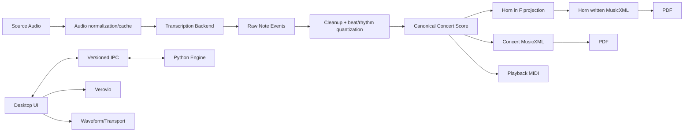

# HornScribe Master Plan

> Status: Active planning baseline  
> Updated: 2026-09-21  
> Product scope: personal-use, Windows-first, local-first, zero recurring cost  
> Detailed engine plan: [DEVELOPMENT_PLAN.md](DEVELOPMENT_PLAN.md)  
> GUI research / architecture background: [GUI_UX_PLAN.md](GUI_UX_PLAN.md)  
> Authoritative interaction specification: [GUI_UX_SPEC.md](GUI_UX_SPEC.md)  
> Visual/component specification: [DESIGN_SYSTEM.md](DESIGN_SYSTEM.md)  
> UX quality gates: [UX_VALIDATION.md](UX_VALIDATION.md)

---

# 1. Purpose of this document

This is the **single roadmap and priority source of truth** for HornScribe.

The other planning documents intentionally contain more implementation detail:

- `DEVELOPMENT_PLAN.md` — transcription, music domain, quantization, notation, Horn in F, export.
- `GUI_UX_PLAN.md` — desktop architecture research and rationale.
- `GUI_UX_SPEC.md` — authoritative screens, states, interactions, keyboard behavior.
- `DESIGN_SYSTEM.md` — authoritative visual/component rules.
- `UX_VALIDATION.md` — authoritative UX/accessibility/performance gates.
- `docs/adr/` — architectural decisions and their evidence.
- GitHub Issues — executable work units.

Conflict resolution:

1. Accepted ADR
2. Master Plan
3. Domain / GUI detailed plans
4. GitHub Issue text

A Proposed ADR is not final. It becomes Accepted only after its validation gate passes.

---

# 2. Product statement

HornScribe is a local desktop transcription review tool for musicians.

Its primary workflow is:

```text
Open local audio
→ listen / choose passage
→ transcribe
→ convert detected performance into readable notation
→ review uncertain passages
→ switch instantly between Concert and Horn in F
→ make small corrections
→ export notation
```

The differentiator is not merely Audio → MIDI.

The core value is:

> **Audio → readable score → trustworthy review → correct F-Horn part**

---

# 3. Non-negotiable constraints

- No paid API.
- No usage-based cloud service.
- No audio upload.
- Main workflow works offline once dependencies/assets are installed.
- Concert pitch is the only canonical internal pitch space.
- Horn in F is a derived written-pitch presentation/export.
- Raw transcription evidence is preserved.
- Expensive analysis never blocks the desktop UI.
- The GUI never independently implements musical transposition logic.
- Uncertain AI output is reviewable and reversible.
- MVP remains a transcription/review tool, not a DAW or full notation editor.
- **ユーザー向けUIは完全日本語とする。英語UI・言語切替は実装しない。**

---

# 4. Changes adopted after architecture review

The original plans contained strong detail but also several risks. The following corrections are now part of the active plan.

## 4.1 Python 3.10 is no longer a fixed baseline

Python 3.10 reaches end-of-life in October 2026 and should not become the long-term foundation of a project starting now.

Basic Pitch 0.4.0 currently declares Python 3.8–3.11 support. Its dependency markers favor ONNX Runtime on Windows below Python 3.11, while Python 3.11 selects TensorFlow; upstream Python 3.12 work is still in progress as of September 2026.

Therefore runtime selection is a measured engineering decision, not a hard-coded version.

Required compatibility matrix:

| Candidate | Basic Pitch path | Main concern | Status |
|---|---|---|---|
| Python 3.10 | ONNX-friendly | EOL imminent | fallback/spike only |
| Python 3.11 | officially declared by Basic Pitch | heavier TensorFlow dependency | primary stable candidate |
| Python 3.12+ | preferred lifecycle | upstream Basic Pitch support not yet stable | experimental until verified |

Before v1, the chosen Python runtime must have an explicit lifecycle/migration plan.

References:
- https://www.python.org/downloads/
- https://github.com/spotify/basic-pitch/blob/main/pyproject.toml
- https://github.com/spotify/basic-pitch/pulls

## 4.2 Basic Pitch is a baseline, not the product architecture

The interface is `TranscriptionBackend`, not `BasicPitch`.

Basic Pitch is the first benchmarked implementation.

Before calling it the default for real use, compare it against at least one monophonic/predominant-melody path on HornScribe's intended material.

The benchmark decision should be driven by correction effort, not only raw note F1.

## 4.3 MIDI semantics are clarified

MusicXML can encode written-pitch versus sounding-pitch transposition explicitly. Standard MIDI File is primarily timed MIDI performance data and does not carry the same notation semantics.

Therefore MVP export semantics are:

### Required

- `concert.musicxml`
- `horn_in_f.musicxml`
- `concert.pdf`
- `horn_in_f.pdf`
- `playback.mid` — **sounding/concert pitch**, suitable for playback

### Optional / advanced

- `performance.mid` — unquantized or minimally processed detected performance
- a written-pitch reference MIDI may be added only if the UI explicitly labels that it is not self-describing as a transposing-instrument score.

Do **not** call a +P5 MIDI file `horn_in_f.mid` without explaining its playback semantics.

Reference:
- https://midi.org/standard-midi-files

## 4.4 Stable identity is a first-class domain requirement

Frontend selection, review history, MusicXML SVG hit-testing and Concert/Horn switching all need stable note identity.

Domain rules:

- every raw note event has a stable ID within a transcription revision
- every canonical score note has a stable canonical ID
- Concert and Horn views refer to the **same canonical note ID**
- MusicXML `note/@id` is populated from a deterministic export ID derived from the canonical note ID
- rendered Verovio IDs are presentation IDs, not the sole source of domain truth
- re-quantization creates a new score revision while retaining provenance links to source raw events where possible

MusicXML 4.0 allows an optional unique `id` attribute on notes.

Reference:
- https://www.w3.org/2021/06/musicxml40/musicxml-reference/elements/note/

## 4.5 Project persistence must be versioned from the beginning

A HornScribe project is not equivalent to exported MusicXML.

Minimum persisted model:

```text
schemaVersion
projectId
sourceAudio:
  originalPath
  contentHash
transcription:
  backend
  backendVersion
  settings
  rawResultRef
score:
  revision
  canonicalConcertData
  quantizationSettings
userEdits
reviewDecisions
uiSession:
  optional/non-authoritative
```

Rules:

- atomic writes
- one recovery snapshot
- schema migrations
- source audio is referenced, never silently modified
- if source path is missing, allow relink and verify content hash
- cache files are rebuildable and not the authoritative project state

Portable project bundles may be added later.

## 4.6 Cancellation must be proven with real inference

A simple JSON `cancel` message does not guarantee that a blocking ML runtime can stop promptly.

Architecture gate:

- first test cooperative cancellation
- if Basic Pitch inference cannot be interrupted within an acceptable time, either:
  - terminate/restart the engine sidecar for cancellation, or
  - isolate long-running inference into a child job process managed by a persistent engine host

Do not design a complex process pool before evidence requires it.

## 4.7 Playback architecture stays abstract until measured

The GUI plan may use HTMLMediaElement/wavesurfer during the spike, but HornScribe must own a `TransportController` abstraction.

The product must not make wavesurfer or HTMLMediaElement its permanent business-logic source of truth.

The spike must measure:

- seek latency
- playback cursor jitter
- loop drift
- playback-rate behavior
- pitch-preservation behavior
- codec/file compatibility
- 3/10-minute memory behavior

Only then is the transport implementation accepted.

## 4.8 Local-file security is explicit

Tauri local media access must use narrow capabilities/scopes.

Requirements:

- no remote CDN resources
- restrictive CSP
- use `wasm-unsafe-eval` only if required for bundled WASM
- asset protocol disabled unless needed
- if enabled, expose only explicitly opened files / cache directories
- dynamically authorize selected file paths rather than exposing the entire home directory
- never enable broad filesystem permissions for frontend convenience

References:
- https://v2.tauri.app/security/csp/
- https://v2.tauri.app/security/asset-protocol/
- https://v2.tauri.app/reference/acl/scope/

## 4.9 “Offline runtime” and “offline installer” are distinct

Runtime must work offline.

A fully offline Windows installer is optional for personal use.

Tauri's WebView2 offline-installer mode adds significant installer size, while current Windows 10/11 generally distribute WebView2 with the OS.

Decision is deferred until packaging milestone.

Reference:
- https://v2.tauri.app/distribute/windows-installer/

---

# 5. System boundaries



Ownership:

### Python engine

Authoritative for:

- transcription
- cleanup
- tempo/beat analysis
- quantization
- canonical score
- note identity/provenance
- Horn in F projection
- MusicXML/MIDI export semantics
- project-domain transformations

### Desktop frontend

Authoritative for:

- layout
- visualization
- playback controls
- user selection
- review interaction
- keyboard commands
- dialogs
- accessibility presentation
- transient UI state

### Rust/Tauri shell

Authoritative for:

- native lifecycle
- file dialogs
- safe filesystem boundary
- worker process supervision
- packaging/native integration

---

# 6. Critical-path implementation sequence

The previous plans described engine phases and GUI phases separately. The actual project should advance through **gated vertical milestones**.

# M0 — Repository hygiene, contracts, fixtures

Goal:
make later work deterministic.

Deliverables:

- [ ] one canonical ADR-0001
- [ ] one set of architecture-spike issues
- [ ] project directory conventions
- [ ] Python compatibility matrix
- [ ] IPC envelope schema
- [ ] canonical score schema draft
- [ ] project file schema v1 draft
- [ ] deterministic ID/provenance rules
- [ ] synthetic audio fixtures
- [ ] MusicXML fixtures
- [ ] expected Horn transposition fixtures
- [ ] baseline benchmark script design

Gate:
No production UI or transcription pipeline grows until data contracts are clear enough to test independently.

---

# M1 — Deterministic music core

Goal:
prove everything that should be exact before involving ML.

Implement:

- canonical concert-pitch domain objects
- score revisions
- note IDs and provenance
- Horn in F projection
- key transposition
- MusicXML note IDs
- Horn `<transpose>` metadata
- MusicXML round trip
- playback MIDI semantics
- project persistence skeleton

Required golden invariants:

```text
Concert C4 → Horn written G4
Horn written G4 + MusicXML -P5 → sounding C4

Concert C major → Horn written G major
Concert F major → Horn written C major
Concert Bb major → Horn written F major
```

MusicXML `<transpose>` describes written → sounding, so F Horn uses:

```xml
<transpose>
  <diatonic>-4</diatonic>
  <chromatic>-7</chromatic>
</transpose>
```

Reference:
https://www.w3.org/2021/06/musicxml40/musicxml-reference/elements/transpose/

Gate:
100% deterministic tests pass.

---

# M2 — Desktop architecture spikes

Goal:
decide whether the proposed Tauri architecture is genuinely suitable.

Issues / gates:

- UI-001 desktop shell
- UI-006 Japanese-only copy foundation
- UI-009 preproduction interaction prototype
- UI-010 design tokens/component states
- UI-011 responsive application shell
- UI-012 keyboard/focus architecture
- UI-001 desktop shell
- UI-002 Python sidecar/lifecycle
- UI-003 Verovio interaction
- UI-004 waveform/transport
- UI-005 unified score/audio timeline

Additional gate requirements:

- narrow Tauri capability/CSP configuration demonstrated
- local media loading path documented
- real Python sidecar packaged
- timing measurements recorded instead of subjective “feels smooth”
- accessibility smoke test
- Windows 100/150/200% DPI smoke test

Decision:

### Pass

Mark ADR-0001 Accepted.

### Fail

Document evidence and run a bounded Qt Quick/QML fallback spike.

Do not simultaneously maintain two desktop implementations.

---

# M3 — Audio and baseline transcription

Goal:
produce raw note events reliably from local audio.

Implement:

- FFmpeg discovery
- audio normalization
- cache key
- `TranscriptionBackend`
- Basic Pitch adapter
- raw note-event persistence
- confidence/provenance
- cleanup pipeline
- failure/cancel behavior

Runtime gate:

Create a measured table for selected Python/backend combination:

- install/build success
- packaged sidecar size
- cold worker start
- model initialization
- 30 sec inference
- 3 min inference
- peak RAM
- cancellation behavior

Gate:
A deterministic synthetic corpus transcribes without corrupting project state.

---

# M4 — Rhythm and notation

This is expected to be one of the highest-risk milestones.

The authoritative quantizer design is:

**[QUANTIZER_DESIGN.md](QUANTIZER_DESIGN.md)**

HSQ-v1 uses:

- seconds → musical-time TimeWarp
- explicit MeterMap / metrical tree
- k-best dynamic programming for onset placement
- onset + IOI timing fidelity
- joint note-duration/rest realization
- notation complexity cost
- tie/rest/tuplet costs
- meter-aware readability
- ReviewIssue generation for ambiguous rhythm

Implementation sequence:

1. QNT-001 — TimeWarp / BeatMap / MeterTree contracts
2. QNT-002 — fixed-BPM binary-grid baselines and onset DP
3. QNT-003 — joint note/rest realization and notation cost
4. QNT-004 — 3/4, 2/4, 6/8 and pickup phase
5. QNT-005 — triplet model and k-best ambiguity
6. QNT-006 — music21/MusicXML realization
7. QNT-007 — benchmark, ablation and weight freeze

Principle:

> Manual correction of BPM/meter is better than pretending an uncertain automatic estimate is authoritative.

Evaluation includes timing accuracy, score-level rhythm error, notation complexity, and user correction effort.

Gate:
synthetic rhythmic fixtures and local horn benchmarks produce valid, readable, deterministic scores and round-trip MusicXML without rhythm mutation.

---

# M5 — First true vertical slice

Goal:
one real end-to-end path before advanced UI work.

```text
Open WAV/MP3
→ play
→ transcribe
→ quantize
→ show Concert score
→ switch Horn in F
→ click score note and hear source location
→ export MusicXML
```

No spectrogram.
No source separation.
No multi-instrument model.
No full notation editor.

Gate:
the complete path works repeatedly after app restart and without internet.

This is the first point that should be called **MVP functional**.

---

# M6 — Review and correction UX

Goal:
reduce human correction effort.

Implement:

- uncertainty queue
- low-confidence indicators
- listen/loop
- previous/next issue
- pitch correction
- delete/restore
- limited split/merge where domain rules are clear
- undo/redo
- raw/cleaned/score comparison
- autosave/recovery

Measure:

- time to review a known fixture
- keyboard-only completion
- number of user actions per correction
- accidental destructive data loss = zero

---

# M7 — Polished MVP

Goal:
make the application feel finished.

Implement/verify:

- design tokens and component consistency
- ja-JPのみ。英語UI・言語切替は対象外
- dark/light/system
- high contrast
- Narrator smoke test
- visual regression
- DPI matrix
- dependency diagnostics
- export sheet
- MuseScore PDF
- session restore
- crash recovery
- performance budget
- app icon/installer

Gate:
Design QA checklist passes on all required states, not only happy-path screenshots.

---

# M8 — Advanced transcription experiments

Only after the polished monophonic/single-instrument path is useful.

Experiment separately with:

- source separation
- predominant melody extraction
- YourMT3+/multi-instrument AMT
- stem selection
- ensemble/commercial mix workflows

Promotion rule:

An experimental backend enters the product only if it improves a defined user metric on the benchmark corpus without unacceptable packaging/runtime cost.

---

# 7. Benchmark strategy

## 7.1 Three test layers

### Synthetic

Generated audio with exact ground truth.

Use for:

- timing
- pitch
- quantization
- regression
- CI

### Public / redistributable

Small CC0/public-domain/generated musical fixtures.

Use for repository-visible end-to-end tests.

### Local private benchmark

User-owned recordings kept under gitignored `benchmarks/local/`.

Use for realistic quality decisions.

Do not commit copyrighted commercial music.

## 7.2 AMT metrics

Record at minimum:

- note onset precision/recall/F1
- note onset+offset F1
- pitch errors
- false short notes
- missed notes

But the product metric is also:

- correction count
- correction time
- readable-score quality after quantization

A backend with slightly lower raw F1 can still be preferable if its errors are easier to review and correct.

## 7.3 Reproducibility metadata

Every benchmark result records:

- audio fixture hash
- backend
- backend version/model hash
- Python runtime
- parameters
- CPU/GPU
- HornScribe commit
- runtime
- peak memory

---

# 8. Japanese-only UI contract

HornScribeのユーザー向けインターフェースは **日本語のみ** とする。

対象:

- ボタン
- メニュー
- タブ/セグメント
- 設定画面
- Inspector
- 進捗表示
- Review理由
- エラー/警告
- 通知
- ツールチップ
- 空状態
- アクセシビリティ名/説明
- 初回案内
- 依存関係不足時の案内

英語UI、言語選択、英語ロケールはMVP/v1の要件に含めない。

例外:

- `MusicXML`, `MIDI`, `FFmpeg`, `MuseScore`, `Basic Pitch` などの固有名詞・標準規格名
- ファイル名、パス、バージョン番号
- キー表記（Ctrl、Shift、Space等）
- 通常画面に露出しないraw developer log / stack trace

ただし例外項目も、通常ユーザーに説明するときの**周辺文言は日本語**にする。

UIの基本用語:

```text
Concert Pitch       → コンサートピッチ
Horn in F           → F管ホルン
Transcribe          → 採譜
Review              → 要確認
Export              → 書き出し
Settings            → 設定
Inspector           → プロパティ
Follow Playback     → 再生位置を追従
Quantization        → 量子化
Confidence          → モデル確信度（証拠として必要な場合のみ）
Needs Review        → 要確認
Cancel              → キャンセル
Retry               → 再試行
Diagnostics         → 診断情報
```

実装原則:

- runtime locale switchは作らない
- 翻訳フレームワーク導入を必須にしない
- ただし頻出用語・エラー文・ステータス文は共通定義して表記ゆれを防ぐ
- 日本語ラベルの実幅を基準にレイアウトする
- Windows日本語IMEを破壊しない
- UIテスト/golden screenshotは日本語を正準とする

---

# 10. Review / uncertainty contract

The UI must not interpret one transcription backend's raw confidence value as a universal probability.

Different backends may provide:

- calibrated or uncalibrated confidence
- frame probabilities
- note probabilities
- no confidence value at all
- multiple competing hypotheses

The engine converts backend-specific evidence into product-level review items.

Suggested contract:

```text
ReviewIssue
  id
  scoreRevision
  canonicalNoteIds[]
  timeRange
  reason
  severity
  evidence
  status
```

Example `reason` values:

- low_model_confidence
- very_short_detection
- overlapping_candidates
- quantization_ambiguous
- pitch_spelling_ambiguous
- outside_preferred_horn_range
- structural_measure_conflict

Rules:

- raw backend confidence may be shown as evidence, not as “probability this note is wrong”
- review severity must not be encoded by color alone
- accepting/dismissing a review issue does not delete raw evidence
- review decisions are persisted against score revision/canonical IDs
- changing transcription/quantization revision may invalidate or remap review issues explicitly

This keeps the Review workspace independent from Basic Pitch and future AMT models.

---

# 9. Transport and timing model

Do not use UI scroll position as time.

Canonical mapping:

```text
source seconds
↔ raw event seconds
↔ tempo map / beat positions
↔ canonical score IDs
↔ MusicXML IDs
↔ rendered SVG elements
```

The authoritative playback clock is selected in the M2 spike.

The frontend exposes:

```ts
interface TransportController {
  play(): Promise<void>
  pause(): void
  seek(seconds: number): Promise<void>
  setRate(rate: number): void
  setLoop(range: TimeRange | null): void
  getCurrentTime(): number
  subscribe(listener: TransportListener): Unsubscribe
}
```

wavesurfer is an adapter/view, not the application model.

---

# 11. Export contract

## MusicXML

Authoritative notation interchange.

Required:

- Concert written as concert pitch
- Horn written +P5 from canonical concert score
- Horn MusicXML transposition metadata = written → sounding -P5
- stable note IDs
- MuseScore and Verovio compatibility tests

## PDF

Derived artifact.

- generated through detected MuseScore Studio CLI for polished engraving
- failure does not invalidate the project or MusicXML
- MuseScore version is captured in diagnostics/export metadata where practical

## MIDI

MVP default:

- `playback.mid`: sounding/concert pitch

Optional:

- `performance.mid`: raw/unquantized performance-like timing

Written Horn MIDI is not a default export because generic MIDI playback does not inherently express MusicXML-style transposing-instrument notation semantics.

---

# 12. Security and privacy gates

Even for personal use, local-first does not mean “grant the WebView the whole filesystem.”

Required:

- restrictive Tauri capabilities
- restrictive CSP
- zero runtime CDN dependency
- no analytics
- no telemetry
- no automatic audio upload
- local-file access limited to opened project/source/cache paths
- subprocess arguments passed safely, never by constructing shell command strings
- export paths normalized/validated
- logs avoid copying raw audio or unnecessary personal paths where possible

---

# 13. Dependency policy

For every runtime dependency record:

- exact package/version
- license
- upstream URL
- why it exists
- whether shipped or external
- whether it accesses network
- update risk
- replacement/fallback

Prefer:

- fewer dependencies
- mature dependencies
- pinning during MVP
- deliberate upgrades with benchmark/golden tests

Do not add a library solely to avoid writing a small deterministic function.

Do not reimplement a mature notation/audio primitive solely to reduce dependency count.

---

# 14. Risk register

| Risk | Impact | Current mitigation |
|---|---|---|
| Python 3.10 EOL / Basic Pitch version tension | High | compatibility matrix; do not hard-pin 3.10 as product baseline |
| Quantization produces unreadable notation | Very High | independent quantizer milestone; notation-complexity tests; manual BPM/meter override |
| Mixed-source AMT accuracy | High | keep MVP scope narrow; backend abstraction; later experiments |
| Tauri/WebView local audio timing | High | UI-004/UI-005 measured spike; TransportController abstraction |
| Python cancellation during ML inference | Medium/High | real cancellation test; process restart/job isolation fallback |
| Python sidecar packaging size/fragility | High | M3 packaging benchmark before product expansion |
| Verovio ID/time mapping | High | stable canonical IDs + MusicXML note IDs + UI-003 |
| Double F-Horn transposition | High | canonical concert score; golden round-trip tests |
| MIDI notation/playback ambiguity | Medium | playback MIDI semantics explicitly defined |
| Project data loss | High | atomic save, schema version, recovery snapshot |
| GUI scope creep into DAW/notation editor | High | editing boundary and milestone gates |
| Excessive frontend permissions | Medium/High | capability/CSP gate |
| Large audio memory use | Medium | streaming media + precomputed peaks experiment; avoid decoding all long audio unless measured safe |
| Dependency drift | Medium | pinned lockfiles + upgrade tests |

---

# 15. Quality gates

A milestone is not done because code compiles.

## Engine gate

- deterministic tests
- invalid-data tests
- round-trip tests
- fixture provenance
- no hidden network access

## UI gate

- keyboard
- light/dark
- 日本語UI
- 1366×768
- 150/200% scaling
- loading/empty/error states
- focus visibility
- no heavy work on UI thread

## Integration gate

- restart app and reopen project
- missing FFmpeg
- missing MuseScore
- worker crash
- cancellation
- read-only/export permission error
- source audio moved
- malformed MusicXML/render failure

## Personal usability gate

Because HornScribe is primarily a personal tool, formal large-sample UX research is unnecessary, but every polished milestone should be dogfooded on repeatable tasks.

Record friction for at least:

1. open audio → first transcription
2. locate one known wrong note
3. loop and compare the source
4. correct/dismiss the review item
5. switch Concert ↔ Horn without losing position
6. export Horn MusicXML/PDF

For each task record:

- completion success
- number of avoidable clicks/keystrokes
- moments of ambiguity
- keyboard-only path
- visual/focus problems

Fix repeated friction before adding advanced features.

---

# 16. Codex execution rules

Every implementation issue must contain:

## Goal
One observable result.

## Dependencies
Concrete issue numbers or “none”.

## Non-goals
Explicitly prevent scope creep.

## Contracts touched
Schemas/interfaces/files that may change.

## Acceptance criteria
Binary/pass-fail where possible.

## Tests
Required automated and manual tests.

## Evidence
For spikes, record measurements/screenshots/log summaries rather than simply checking boxes.

Rules:

- one issue should normally fit one coherent PR
- do not mix refactoring and new behavior without reason
- no new dependency without documenting purpose/license
- no architecture change only inside code; update ADR/plan
- a spike may be discarded after recording evidence
- do not polish a component whose underlying architecture has not passed its gate

---

# 17. Immediate next work

Do these in order:

1. **FND-001** — define canonical IDs, score revision/provenance schema, project schema v1.
2. **FND-002** — Python/Basic Pitch compatibility and packaging matrix.
3. **ENG-001** — deterministic Horn in F core + MusicXML round-trip.
4. Run **UI-001 → UI-005** architecture spikes.
5. Accept/reject ADR-0001 using recorded evidence.
6. Implement baseline transcription and quantization only after the core contracts and UI architecture are stable enough.

This order prevents two expensive failure modes:

- building polished UI around unstable domain identifiers
- building a large Python packaging stack around a runtime choice that is already obsolete

---

# 18. MVP definition

HornScribe is **MVP complete** when all of the following are true:

- Windows desktop app launches reliably.
- WAV/MP3 can be opened and played.
- Audio remains local.
- A baseline backend transcribes a supported single-instrument/prominent-melody fixture.
- Raw events are preserved.
- A valid readable score is generated.
- BPM/meter can be manually corrected without retranscribing.
- Concert score is viewable.
- Horn in F score is derived correctly.
- Concert/Horn switching preserves musical context.
- Score click ↔ audio seek works.
- User can loop a passage.
- User can review/correct at least pitch and false-note errors.
- MusicXML exports for Concert and Horn in F pass round-trip tests.
- Horn MusicXML sounds at the original concert pitch.
- `playback.mid` has documented sounding-pitch semantics.
- MuseScore, when installed, can produce Concert/Horn PDFs.
- Missing optional tools fail gracefully.
- Project autosave/recovery works.
- Major workflows have automated regression coverage.
- Runtime works without cloud/API access.

Everything beyond this is v1 polish or advanced transcription work.

---

# 19. Reference facts checked during this review

- Python 3.10 support ends in October 2026: https://www.python.org/downloads/
- Basic Pitch 0.4.0 currently declares Python through 3.11 and has open 3.12-related work: https://github.com/spotify/basic-pitch/blob/main/pyproject.toml
- Tauri can bundle/launch sidecar binaries: https://v2.tauri.app/develop/sidecar/
- Tauri local assets require scoped asset-protocol access: https://v2.tauri.app/security/asset-protocol/
- Tauri recommends restrictive CSP and avoiding remote scripts/CDNs: https://v2.tauri.app/security/csp/
- Tauri supports an offline WebView2 installer option for Windows: https://v2.tauri.app/distribute/windows-installer/
- Verovio provides element/time mapping APIs: https://book.verovio.org/toolkit-reference/toolkit-methods.html
- wavesurfer.js 7.x remains stable while 8.x is beta as of the current review: https://github.com/katspaugh/wavesurfer.js/releases
- MusicXML transposition is written pitch → sounding pitch: https://www.w3.org/2021/06/musicxml40/musicxml-reference/elements/transpose/
- MusicXML notes can carry unique IDs: https://www.w3.org/2021/06/musicxml40/musicxml-reference/elements/note/
- Standard MIDI Files store timed MIDI streams and metadata but are not MusicXML-style notation documents: https://midi.org/standard-midi-files
